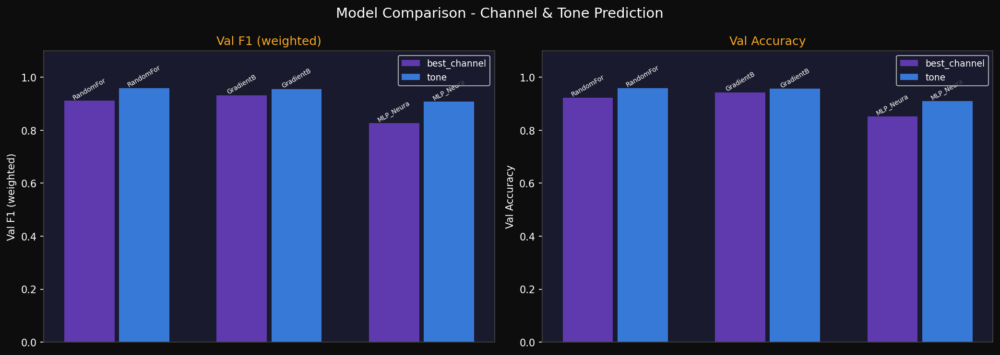

# NeuroStrat — AI Outreach Decision Engine

> *"Every other AI tool teaches the machine to speak. NeuroStrat teaches it to think."*

**NeuroStrat** is an AI-powered B2B outreach strategy engine that analyses prospect signals and decides — intelligently — which channel to use, what tone to strike, and why. Built end-to-end with a custom ML pipeline, a FastAPI backend, and a React frontend.

 **Live Demo:** [neurostrat-tau.vercel.app](https://neurostrat-tau.vercel.app)  
 **Backend API:** [neurostrat.onrender.com/docs](https://neurostrat.onrender.com/docs)

---

## The Problem This Solves

Existing outreach tools (Apollo, Lemlist, HeyReach) help you *send* messages. None of them help you *decide* how to reach out in the first place. There's no intelligence behind channel selection, timing, or tone — it's just automation.

NeuroStrat fills that gap. It's a **decision-making system**, not just an automation tool. Given a prospect's role, context, and behavioural signals, it reasons across 11 dimensions and returns a concrete, explainable strategy recommendation.

---

## Demo

| Input | Output |
|---|---|
| "Sarah Chen, VP of Engineering, active on LinkedIn, Series B SaaS" | LinkedIn DM · Value-Led · 91% confidence |
| "Tom Richards, Carpenter, small local business, no LinkedIn" | Cold Call · Curiosity-Led · 97% confidence |
| "Marcus Webb, CEO, cold lead, enterprise company, struggling" | Email · Formal · 94% confidence |

---

## Architecture

```
┌─────────────────────────────────────────────────────────────────┐
│                     React Frontend (Vite)                       │
│         ScenarioForm → POST /api/strategy → StrategyCard        │
└──────────────────────────┬──────────────────────────────────────┘
                           │ HTTP + CORS
┌──────────────────────────▼──────────────────────────────────────┐
│                  FastAPI Backend (Python)                       │
│                                                                 │
│  signal_extractor.py    ←  free-text → 11 ML features           │
│  inference.py           ←  ML model prediction                  │
│  response_builder.py    ←  ML output → frontend JSON            │
│  history_store.py       ←  SQLite persistence                   │
└──────────────────────────┬──────────────────────────────────────┘
                           │
┌──────────────────────────▼──────────────────────────────────────┐
│                  ML Pipeline (scikit-learn)                     │
│                                                                 │
│  OutreachFeatureEngineer  ←  5 engineered features              │
│  GradientBoostingClassifier  ←  channel prediction (93% F1)     │
│  RandomForestClassifier      ←  tone prediction   (96% F1)      │
└─────────────────────────────────────────────────────────────────┘
```

---

## ML Model — Technical Details

This is the core of the project. The ML pipeline was designed, trained, and evaluated from scratch.

### Problem Framing

Multi-output classification:
- **Target 1:** Best outreach channel (5 classes: LinkedIn DM, LinkedIn InMail, Email, Cold Call, Twitter/X DM)
- **Target 2:** Message tone (5 classes: Formal, Casual, Value-Led, Curiosity-Led, Direct)

### Input Features (11 total)

| Feature | Type | Description |
|---|---|---|
| `engagement_score` | float [0,1] | Prospect's historical engagement level |
| `linkedin_active` | float [0,1] | LinkedIn platform activity score |
| `news_sentiment` | float [-1,1] | Sentiment of recent news/events |
| `time_of_day` | int 0–23 | Hour of proposed outreach |
| `days_since_last` | int | Days since last interaction |
| `past_response_rate` | float [0,1] | Historical reply rate |
| `profile_completeness` | float [0,1] | LinkedIn profile completeness |
| `mutual_connections` | int | Shared network connections |
| `role` | categorical | Seniority tier (C-Suite → IC) |
| `industry` | categorical | Industry vertical |
| `company_size` | categorical | Company headcount band |

### Engineered Features

Beyond the raw inputs, a custom `OutreachFeatureEngineer` transformer (implementing scikit-learn's `BaseEstimator` / `TransformerMixin` interface) computes 5 additional derived features:

| Feature | Formula | Captures |
|---|---|---|
| `recency_score` | `e^(-0.05 × days)` | Relationship freshness decay |
| `engagement_momentum` | `engagement × past_response` | Combined signal strength |
| `peak_hour_flag` | 1 if hour ∈ {9–11, 14–16} | B2B outreach sweet spots |
| `social_reach` | `linkedin × (mutual / max_mutual)` | Network proximity |
| `sentiment_urgency` | `news_sentiment × engagement` | Context-amplified signal |

### Training Pipeline

Three model families were trained and compared for each target:

| Model | Channel Val F1 | Tone Val F1 | Train Time |
|---|---|---|---|
| RandomForest (n=200) | 0.8869 | 0.9598 | 16s |
| **GradientBoosting (n=150)** | **0.9325** | 0.9565 | 23s |
| MLP Neural Network (256→128→64) | 0.8266 | 0.9090 | 5s |

**Winner: GradientBoosting for channel, RandomForest for tone**

After model selection, RandomizedSearchCV hyperparameter optimisation (10 iterations, 3-fold stratified CV) was run on the winner per target.

### Final Test Set Results

**Channel Prediction**
```
               precision  recall  f1-score  support
Cold Call          1.00    0.45      0.62       11
Email              0.93    0.98      0.95       89
LinkedIn DM        0.94    1.00      0.97      167
LinkedIn InMail    0.00    0.00      0.00        6
Twitter/X DM       1.00    0.85      0.92       27
─────────────────────────────────────────────────
weighted avg       0.92    0.94      0.93      300
```

**Tone Prediction**
```
               precision  recall  f1-score  support
Casual             0.92    0.58      0.71       19
Curiosity-Led      0.93    0.99      0.96       91
Direct             0.92    0.71      0.80       17
Formal             1.00    0.61      0.76       18
Value-Led          0.90    0.97      0.94      155
─────────────────────────────────────────────────
weighted avg       0.92    0.92      0.91      300
```

### Model Evaluation Plots

<p float="left">
  
  
</p>
<p float="left">
  
  
</p>

---

## Signal Extraction — Bridging Natural Language to ML Features

One of the more interesting engineering challenges: the frontend sends free-text `{name, role, context}` but the ML model needs structured numerical features. The `signal_extractor.py` module bridges this gap using a three-layer approach:

**Layer 1 — Role-based priors**
Every job title is mapped to a baseline feature distribution. A "Cobbler" starts with `linkedin_active=0.10` and `engagement=0.25` (trades workers rarely use LinkedIn). A "Software Engineer" starts at `linkedin_active=0.72` and `engagement=0.68`. These priors ensure different roles produce meaningfully different outputs even with minimal context.

**Layer 2 — Broad vocabulary analysis**
General positive/negative language in the context field shifts scores continuously. Words like "ghosted", "struggling", "cold" reduce engagement. Words like "referred", "active", "raised funding" increase it. This works on any natural language, not just predetermined exact phrases.

**Layer 3 — Deterministic identity hash**
A small, stable offset derived from `hash(name + role)` ensures two different people with similar descriptions always produce different feature vectors — giving the ML model genuine variation to work with.

---

## Project Structure

```
neurostrat/
│
├── frontend/                   React + Vite + Tailwind + shadcn/ui
│   └── src/
│       ├── pages/
│       │   ├── Index.tsx       Main dashboard + strategy form
│       │   └── History.tsx     Past outreach decisions
│       └── components/
│           ├── ScenarioForm.tsx
│           └── StrategyCard.tsx
│
├── backend/                    FastAPI + SQLite
│   ├── app.py                  All routes + startup
│   ├── signal_extractor.py     Text → ML features (3-layer system)
│   ├── response_builder.py     ML output → frontend JSON
│   ├── history_store.py        SQLite persistence
│   └── requirements.txt
│
└── ml/                         scikit-learn ML pipeline
    ├── data_generator.py       Synthetic dataset (3,000 cases)
    ├── feature_pipeline.py     Custom ColumnTransformer + feature engineering
    ├── train_evaluate.py       Training loop + HPO + evaluation plots
    ├── inference.py            OutreachDecisionEngine class
    └── models/                 Serialised .joblib artefacts (gitignored)
```


## Running Locally

### Prerequisites
- Python 3.10+
- Node.js 18+

### 1. Train the ML model
```bash
cd ml
pip install -r requirements.txt
python train_evaluate.py
# Takes ~3 minutes. Creates models/ folder with .joblib files.
```

### 2. Start the backend
```bash
cd backend
pip install -r requirements.txt
uvicorn app:app --reload --port 8000
# API docs available at http://localhost:8000/docs
```

### 3. Start the frontend
```bash
cd frontend
npm install
npm run dev
# App available at http://localhost:5173
```

---

## API Reference

| Method | Endpoint | Description |
|---|---|---|
| `GET` | `/api/health` | Server + model status |
| `POST` | `/api/strategy` | Generate outreach strategy |
| `GET` | `/api/history` | List past decisions |
| `GET` | `/api/stats` | Aggregate statistics |

**POST /api/strategy**
```json
// Request
{ "name": "Sarah Chen", "role": "VP of Engineering", "context": "..." }

// Response
{
  "channel": "LinkedIn",
  "confidence": 91,
  "contactName": "Sarah Chen",
  "factors": [
    "LinkedIn DM recommended: high activity and mutual connections signal warm receptivity.",
    "Use a Value-Led tone: lead with clear ROI framing.",
    "Engagement score is high (84%) — prospect shows consistent activity signals.",
    "Positive news context (+0.34) — recent growth signals detected.",
    "Recent interaction (5d ago) — relationship is warm and timely."
  ]
}
```

---

## Tech Stack

**ML / Data**
- scikit-learn 1.7 — model training, pipelines, evaluation
- NumPy, Pandas, SciPy — data processing
- Matplotlib, Seaborn — evaluation visualisations
- Joblib — model serialisation

**Backend**
- FastAPI — async REST API
- Uvicorn — ASGI server
- Pydantic — request/response validation
- SQLite — zero-infrastructure history persistence

**Frontend**
- React + TypeScript
- Vite — build tooling
- Tailwind CSS — styling
- shadcn/ui — component library
- React Query — data fetching

**Infrastructure**
- Vercel — frontend hosting
- Render — backend hosting
- GitHub Actions — CI (optional)

---

## What I Learned

Building this end-to-end taught me a lot about the full ML product lifecycle — not just training a model in isolation, but thinking about how a model's output gets consumed by a real user through a real interface. The most interesting engineering problem was designing `signal_extractor.py`: taking unstructured natural language and reliably mapping it to a feature vector that gives the ML model genuine variation to reason over. I used a combination of role-based priors, broad vocabulary analysis, and deterministic hashing to solve that, which felt like a proper systems design problem rather than a pure ML one.

I used AI assistance as a development tool throughout — for accelerating boilerplate, debugging, and getting a second opinion on architecture decisions — while driving the overall design, the ML methodology choices, and the product logic myself.

---

## Acknowledgements

Built for **LOC 8.0 Hackathon** — AI Outreach Decision Engine problem statement.  
Team: **Heisenbug**
